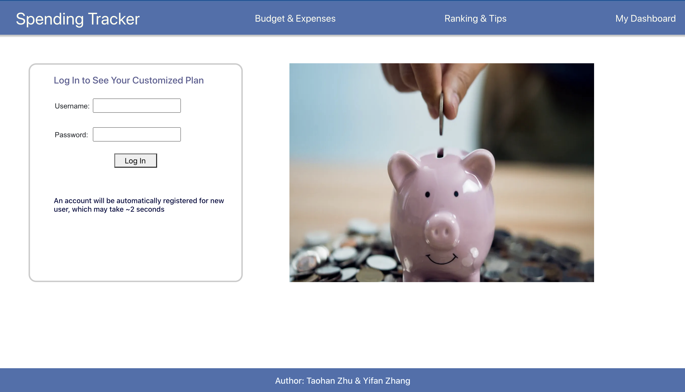
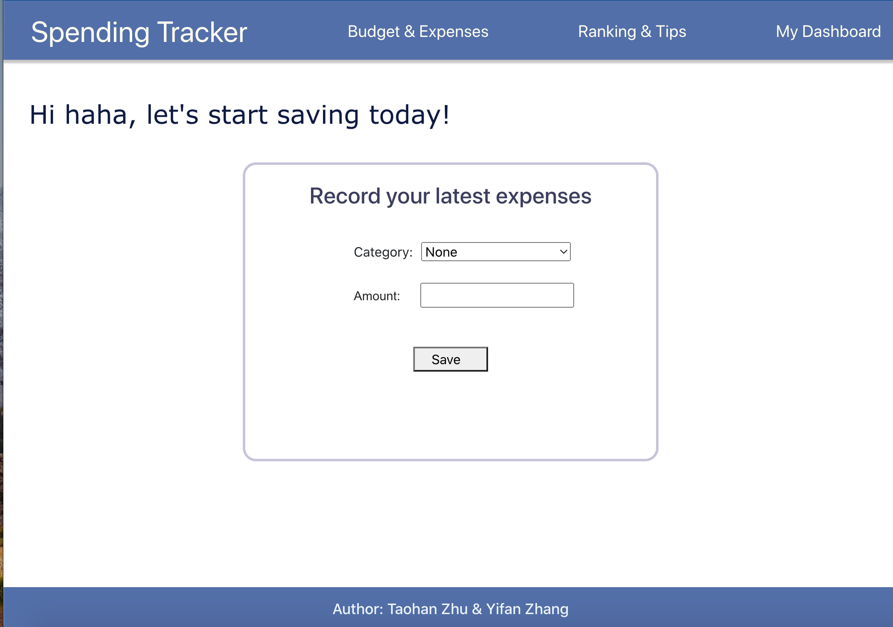
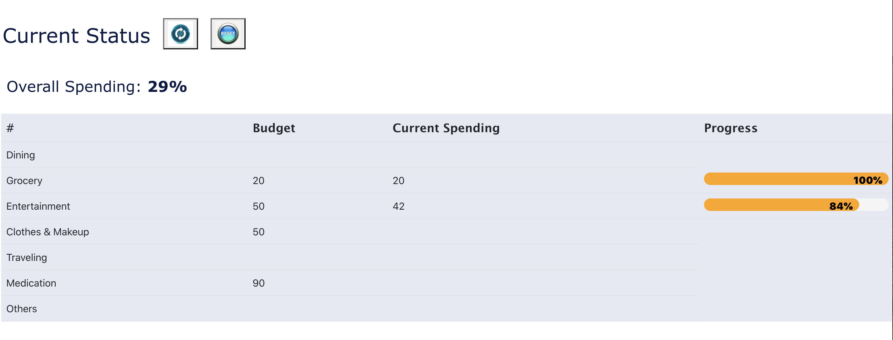
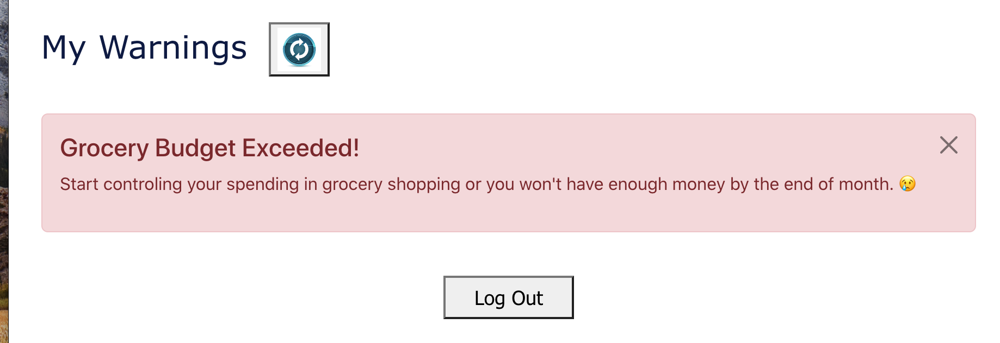

# Project 3: Spending Tracker

### Authors:

- Taohan Zhu and Yifan Zhang

### Class Link:

- [Northeastern University CS5610](https://johnguerra.co/lectures/webDevelopment_fall2022/)

### Web App URL:

- Frontend: [Render.com](https://savewithustoday.onrender.com/account)

## Project Objective

We want to create a web application that helps users keep track of their spending and saving on a daily basis. This app aims to let users put down their budgets, display current spending status based on budgets and send out alerts when users are spending too much.

### Progress By Nov 15th

- Client side designed and preliminary page (struct) constructed
- Login functionality built in both client side and server side
- Server side APIs for spending CRUD implemented and tested via Postman

### Progress By Nov 22nd

- Login funtionality using Passport.js
  
- Allow users to input spending and store data in MongoDB
  
- Dashboard shows current status, including progress bar showing spending
  percentage to budget
  
- Warnings when budget is exceeded
  

## Instructions to build

- Clone this git repository to your local computer
- Server
  - `cd ./server && npm install` to install all required dependencies for server side
  - Use command `npm run start` to start the backend server
- Client
  - `cd ./client && npm install` to install all required dependencies for client side
  - Use command `npm run start` to initiate the client side webpage in your localhost
