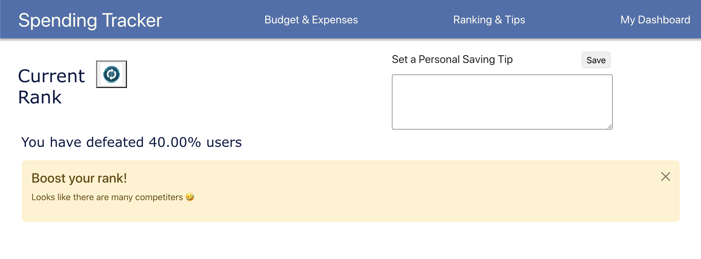

# Project 3: Spending Tracker

### Authors:

- Taohan Zhu and Yifan Zhang

### Class Link:

- [Northeastern University CS5610](https://johnguerra.co/lectures/webDevelopment_fall2022/)

### Web App URL:

- Project-3: [Render.com](https://savewithustoday.onrender.com/)
- Final Deployment: [Render.com](https://savewithustoday-cs5610.onrender.com)

### Design Doc Link:

- [Design Doc](https://docs.google.com/document/d/1XUuSi9c5Sal9Rxedo3zFdvfOoCsSGGy5Y-GhISV-ebw/edit?usp=sharing)

### Powerpoint Links:

- [Project 3](https://docs.google.com/presentation/d/103JV4gYfpZEIUTZt7s4ClHSkGExUe5ZJ8ycUypB2-L8/)
- [Final Project](https://docs.google.com/presentation/d/1bRgVtVx6Efx3Hl5dwiWP2jGry0DcGHBoUQg0WBbe7IA/)

### Demo Videos:
- [Project 3](https://youtu.be/JQskg0HS9mQ)
- [Final Project](https://youtu.be/WzawJhDVpzo)

## Project Objective

We want to create a web application that helps users keep track of their spending and saving on a daily basis. This app aims to let users put down their budgets, display current spending status based on budgets and send out alerts when users are spending too much.

### Progress By Nov 15th

- Client side designed and preliminary page (struct) constructed
- Login functionality built in both client side and server side
- Server side APIs for spending CRUD implemented and tested via Postman

### Progress By Nov 22nd

- Login funtionality using Passport.js
  
- Allow users to input spending and store data in MongoDB
  
- Dashboard shows current status, including progress bar showing spending
  percentage to budget
  
- Warnings when budget is exceeded
  

### Final Progress Since Nov 22d

- Rank & Tips page shows a saving tip and current rank among all users

- Deployment to Render.com (tried both integrated and seperated backend & frontend approach)

## Instructions to build

- Clone this git repository to your local computer
- Server
  - `cd ./server && npm install` to install all required dependencies for server side
  - Use command `npm run start` to start the backend server
- Client
  - `cd ./client && npm install` to install all required dependencies for client side
  - Use command `npm run start` to initiate the client side webpage in your localhost

## Feedback by Harshit Gajjar
Nice and clean UI and amazing work implementing the passportjs. I tried using the website and most of the things were pretty much clear and easy to understand. However, I would like to provide some feedback.
1. If you can distinguish the login page and home page. Even if i am logged in, it still shows me the login fields and even when I am not logged in, it shows logout button on dashboard page, which can be little confusing.

2. On Budget and Expenses page, If i want to add multiple categories, I have to click save button multiple time and it takes me to dashboard. Instead if allow user to enter all the budgets and expenses and a save button at the end, which will save all the data in one go. This will eliminate number of clicks and improve user experience.

3. In Ranking and tips page, when i click save for the tip, if you can show a popup or modal to show that it got saved.. it seemed to be at first that the website is frozen.. since nothing was happening.

Overall, the website was able to demonstrate its purpose and I liked the progress bar in Dashboard. Great work!!
